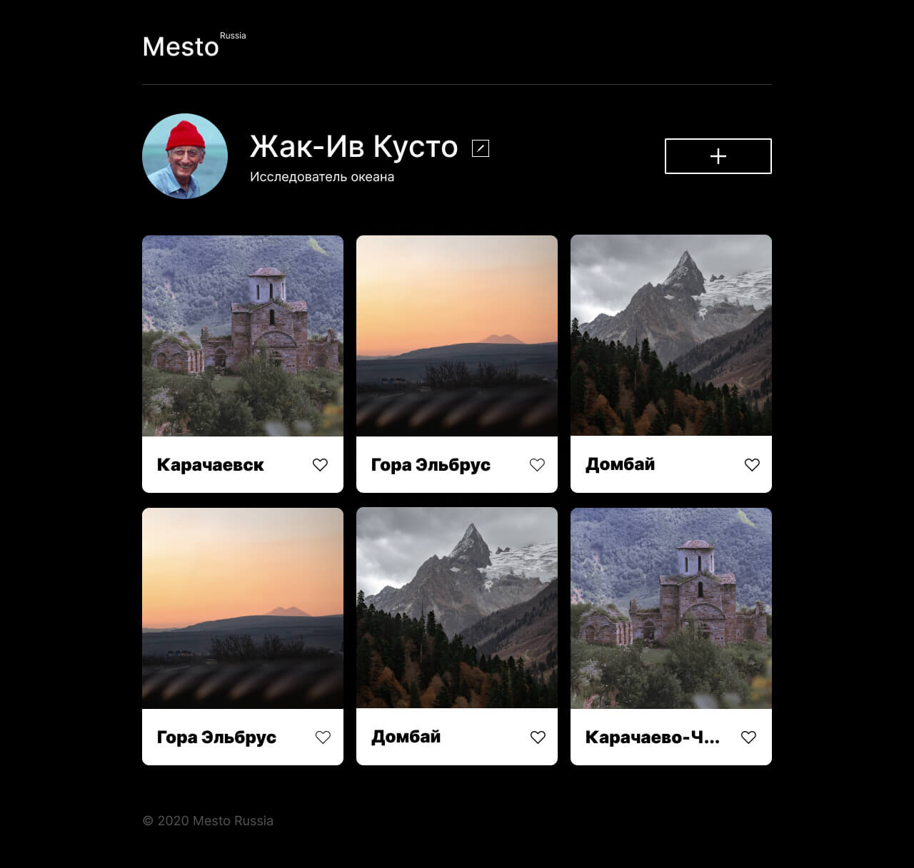

# Приложение Mesto :sparkler:

Это интерактивная страница, куда можно добавлять фотографии, удалять их и ставить друг другу лайки. Реализовано три модальных окна, с помощью которых можно редактировать профиль, загружать новые фотографии и просматривать фото в галлерее.

## [Ссылка на сайт](https://alenazavadskaya.github.io/mesto-react/)

### :computer: Установка и запуск проекта
*1. клонируйте репозиторий:* 
`git clone https://github.com/AlenaZavadskaya/mesto-react.git` 
*2. установите зависимости:* 
 `npm install` 
*3. осуществите сборку:* 
 `npm run build` 
 *4. запустите сервер:* 
 `npm start` 

### :rocket: Технологии
- React
- JavaScript
- ООП
- Функциональные компоненты 
- CSS 
- Flexbox
- JSX
- BEM 

